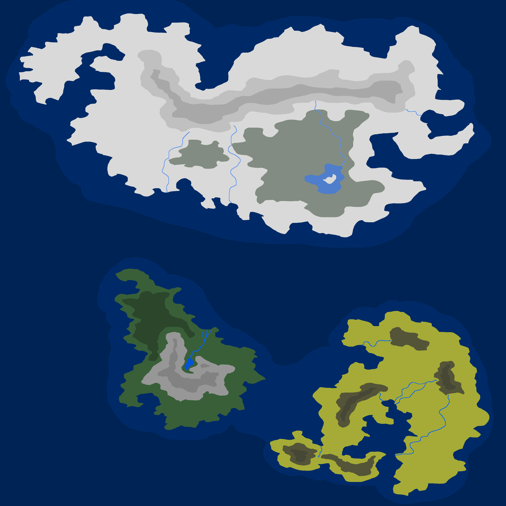

# Elarth

</img>

*Elarth* is a data pack to introduce players to [CTGen].
It features three continents:
* The Northern Continent - a harsh and cold continent, a giant snowy desert
* The Western Continent - a place, where horses and villages can thrive
* The Eastern Continent - hot temperatures have turned the earth into sand

The rest of the world will be filled with an endless deep ocean.

</img>

The amazing map was created by [Deathslayor].

---

If you want to use CTGen on a server so you can enjoy your custom generated minecraft worlds with friends, I suggest trying out BisectHosting.
You can use the code "woodwalkers" to receive a 25% discount on your first month, and you'll also support the development of CTGen.

</img>

---

### License

Elarth is licensed under [Crafted License 1.0](LICENSE.md).

[CTGen]: https://github.com/ToCraft/CTGen/
[Deathslayor]: https://github.com/Deathslayor/
